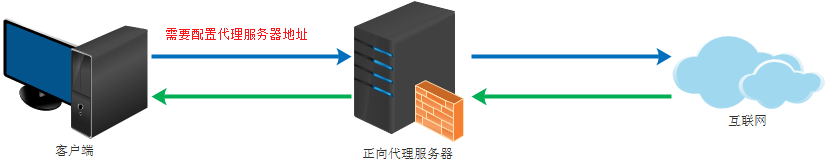
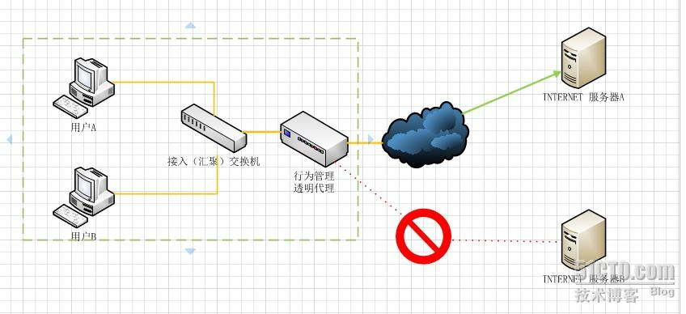

[文章来源](https://www.cnblogs.com/Anker/p/6056540.html)

# 正向代理与反向代理(forward and reverse proxy)

## 1、前言

　　最近工作中用到反向代理，发现网络代理的玩法还真不少，网络背后有很多需要去学习。而在此之前仅仅使用了过代理软件，曾经为了访问google，使用了代理软件，需要在浏览器中配置代理的地址。我只知道有代理这个概念，并不清楚代理还有正向和反向之分，于是赶紧学习一下，补充一下知识。首先弄清楚什么是正向代理，什么是反向代理，然后是二者在实际使用中展示的方式是什么样的，最后总结一下正向代理用来做什么，反向代理可以做什么。

## 2、正向代理

　　正向代理类似一个跳板机，代理访问外部资源。
  
 

举个例子：

　　我是一个用户，我访问不了某网站，但是我能访问一个代理服务器，这个代理服务器呢,他能访问那个我不能访问的网站，于是我先连上代理服务器,告诉他我需要那个无法访问网站的内容，代理服务器去取回来,然后返回给我。从网站的角度，只在代理服务器来取内容的时候有一次记录，有时候并不知道是用户的请求，也隐藏了用户的资料，这取决于代理告不告诉网站。

　　总结来说：正向代理 是一个位于客户端和原始服务器(origin server)之间的服务器，为了从原始服务器取得内容，客户端向代理发送一个请求并指定目标(原始服务器)，然后代理向原始服务器转交请求并将获得的内容返回给客户端。客户端必须要进行一些特别的设置才能使用正向代理。

### 正向代理的用途：
- 访问原来无法访问的资源，如google
- 加速访问服务器(如A要访问B比较慢，可能通过中间代理C后速度更快)
- 可以做缓存，加速访问资源
- 对客户端访问授权，上网进行认证（如公司设置的上网代理，没有权限的人无法上网）
- 对外隐藏用户信息, 代理可以记录用户访问记录（上网行为管理）

## 3、反向代理

　　初次接触方向代理的感觉是，客户端是无感知代理的存在的，反向代理对外都是透明的，访问者者并不知道自己访问的是一个代理。因为客户端不需要任何配置就可以访问。

　　反向代理（Reverse Proxy）实际运行方式是指以代理服务器来接受internet上的连接请求，然后将请求转发给内部网络上的服务器，并将从服务器上得到的结果返回给internet上请求连接的客户端，此时代理服务器对外就表现为一个服务器。

### 反向代理的作用：

- 保证内网的安全，可以使用反向代理提供WAF功能，阻止web攻击

大型网站，通常将反向代理作为公网访问地址，Web服务器是内网。

- 负载均衡，通过反向代理服务器来优化网站的负载

## 4、透明代理

　　如果把正向代理、反向代理和透明代理按照人类血缘关系来划分的话。那么正向代理和透明代理是很明显堂亲关系，而正向代理和反向代理就是表亲关系了 。
  
　　透明代理的意思是客户端根本不需要知道有代理服务器的存在，它改编你的request fields（报文），并会传送真实IP。注意，加密的透明代理则是属于匿名代理，意思是不用设置使用代理了。 透明代理实践的例子就是时下很多公司使用的行为管理软件。如下图：
   

　　用户A和用户B并不知道行为管理设备充当透明代理行为，当用户A或用户B向服务器A或服务器B提交请求的时候，透明代理设备根据自身策略拦截并修改用户A或B的报文，并作为实际的请求方，向服务器A或B发送请求，当接收信息回传，透明代理再根据自身的设置把允许的报文发回至用户A或B，如上图，如果透明代理设置不允许访问服务器B，那么用户A或者用户B就不会得到服务器B的数据。

### 缓存污染攻击：

　　透明代理可能导致缓存污染攻击。代理服务器可以看到拦截的请求里目标端IP和主机头HOST信息，但没有办法立刻确认要连接的目标IP是否真的和HOST里设定的服务器名称相匹配。除非额外先做一次查询，确定两者是否真的有关，否则两边串通一气的客户端和服务器端就有机可乘了。如果不做额外的检查，攻击者只需要请求连接自己家中的服务器，但发送的是一个故意误导代理的HOST请求头www.google.com，这样其他的确想访问www.google.com的用户，获得的可能就是被错误缓存的响应内容了。
