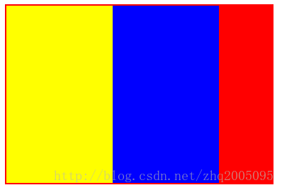

[文章来源](http://blog.csdn.net/zhq2005095/article/details/68955129)
# BFC 的定义

首先 BFC 这个词语的英文的全称为 block formmating context。直译为”块级格式化上下文”。它是一个独立的渲染区域，只有Block-level box参与， 它规定了内部的Block-level Box如何布局，并且与这个区域外部毫不相干。

# BFC布局规则

1.内部的Box会在垂直方向，一个接一个地放置。
2.Box垂直方向的距离由margin决定。属于同一个BFC的两个相邻Box的margin会发生重叠.
3.每个元素的margin box的左边， 与包含块border box的左边相接触(对于从左往右的格式化，否则相反)。即使存在浮动也是如此。
4.BFC的区域不会与float box重叠。
5.BFC就是页面上的一个隔离的独立容器，容器里面的子元素不会影响到外面的元素。反之也如此。
6.计算BFC的高度时，浮动元素也参与计算

#生成BFC的条件

-根元素
-float属性不为none
-position为absolute或fixed
-display为inline-block, table-cell, table-caption, flex, inline-flex
-overflow不为visible

# BFC的作用

## 1. 自适应两栏布局

````HTML
<div class="container">
    <div class="aside"></div>
    <div class="main"></div>
</div>
````

````CSS

.container {
    width: 300px;
}
.aside {
    width: 100px; 
    height: 200px;
    border: 2px solid black;
    float: left;
}
.main {
    height: 200px;
    background: red;
}
````

此时，效果图如下：


可以看出，此时 div.main 与 div.aside 重合了。

当将div.main的CSS 改成这样：

````css
.main {
    height: 200px;
    background: red;
    overflow: hidden; // 这样就让 div.main 形成了 BFC
}
````

改完之后的效果如下：


则，此时div.main已经形成了BFC，根据BFC布局规则的第4条：BFC的区域不会与float box重叠。故div.main不会与左浮动的div.aside重叠了。

## 清除浮动

````HTML
<div class="parent">
    <div class="child left"></div>
    <div class="child right"></div>
</div>
````
````CSS
.parent {
    width: 300px;
    background: red;
    border: 2px solid red;
}
.child {
    width: 120px;
    height: 200px;
    float: left;
    background: yellow;
}
.left {
    background: yellow;
}
.right {
    background: blue;
}
````
效果如图:


从图中可以看出来，当子元素都浮动之后，父元素的高度会塌陷。一般这时候选择给父元素设置一个高度。

但是将div.parent元素的CSS样式改一下：

````css
.parent {
    width: 300px;
    background: red;
    border: 2px solid red;
    overflow: hidden; // 添加这个属性之后，将div.parent变成了BFC
}
````

此时效果如图所示：


则此时，并没有给div.parent这个父元素设置高度，而父元素并没有发生塌陷。这是利用了BFC布局规则中的第六条： 计算BFC的高度时，浮动元素也参与计算。

## 防止垂直 margin 重叠

````HTML
<div class="parent">
    <div class="child above">above</div>
    <div class="child below">below</div>
</div>
````

````CSS

.parent {
    width: 300px;
    border: 2px solid red;
    font-size: 30px;
}
.child {
    height: 200px;
    margin: 50px 0;
}
.above {
    background: yellow;
}
.below {
    background: blue;
}
````

则此时，根据margin-collapse的理论，div.below和div.above之间会发生margin合并，即二者之间的margin值为50px，而不是100px。

如图所示：


那么，如果说，我们想要达到div.below和div.above之间的margin值为100px，即二者之间不发生margin合并的话，则可以借助于BFC布局规则的第二条： Box垂直方向的距离由margin决定。属于同一个BFC的两个相邻Box的margin会发生重叠。将div.below和div.above设置到不同的BFC中去。则此时二者之间的margin就不会发生合并。

在div.below之外包一层div.wrap，并且将div.wrap设置为overflow: hidden，则将div.wrap形成了BFC。此时div.above和div.below之间，就不会发生垂直margin合并了。二者之间的margin值为100px。

````HTML
<div class="parent">
    <div class="child above"></div>
    <div class="wrap">
        <div class="child below"></div>
    </div>
</div>
````

````CSS
.parent {
    width: 300px;
    border: 2px solid red;
    font-size: 30px;
}
.child {
    height: 200px;
    margin: 50px 0;
}
.above {
    background: yellow;
}
.below {
    background: blue;
}
.wrap {
    overflow: hidden;
}
````

此时的效果如下图所示：


则此时div.above和div.below的垂直间距才为100px。
