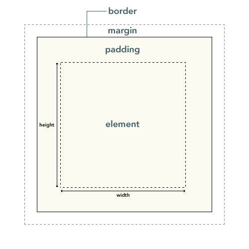

# 一、css盒子模型概念

CSS盒子模型 又称框模型 (Box Model) ，包含了元素内容（content）、内边距（padding）、边框（border）、外边距（margin）几个要素（如下图）。图中最内部的框是元素的实际内容，也就是元素框，紧挨着元素框外部的是内边距padding，其次是边框（border），然后最外层是外边距（margin），整个构成了框模型。通常我们设置的背景显示区域，就是内容、内边距、边框这一块范围。而外边距margin是透明的，不会遮挡周边的其他元素。



那么:
````
元素框的总宽度 = 元素（element）的width + padding的左边距和右边距的值 + margin的左边距和右边距的值 + border的左右宽度；

元素框的总高度 = 元素（element）的height + padding的上下边距的值 + margin的上下边距的值 ＋ border的上下宽度。
````

# 二、box-sizing属性介绍

box-sizing属性是用户界面属性里的一种，之所以介绍它，是因为这个属性跟盒子模型有关，而且在css reset中有可能会用到它。

box-sizing : content-box|border-box|inherit;

## (1) content-box
默认值，可以使设置的宽度和高度值应用到元素的内容框。盒子的width只包含内容。
````
总宽度=margin+border+padding+width
````
## (2) border-box
设置的width值其实是除margin外的border+padding+element的总宽度。盒子的width包含border+padding+内容
````
即总宽度=margin+width
````
很多CSS框架，都会对盒子模型的计算方法进行简化。

## (3) inherit
规定应从父元素继承 box-sizing 属性的值

关于border-box的使用：

1 一个box宽度为100%，又想要两边有内间距，这时候用就比较好

2 全局设置 border-box 很好，首先它符合直觉，其次它可以省去一次又一次的加加减减，它还有一个关键作用——让有边框的盒子正常使用百分比宽度。
