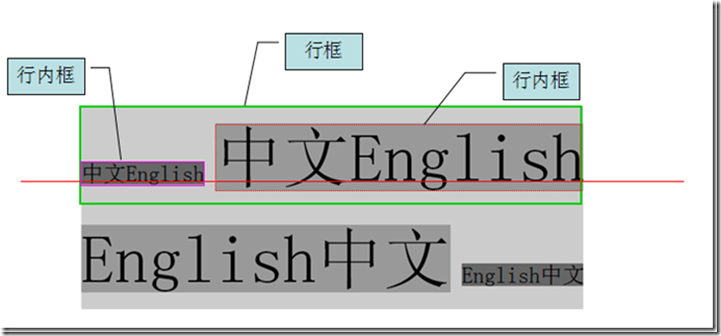

[文章来源](https://www.cnblogs.com/dolphinX/p/3236686.html)

# CSS行高——line-height

初入前端的时候觉得CSS知道display、position、float就可以在布局上游刃有余了，随着以后工作问题层出不穷，才逐渐了解到CSS并不是几个style属性那么简单，最近看了一些关于行高的知识，就此总结一下。

所谓行高是指文本行基线间的垂直距离。要想理解这句话首先得了解几个基本知识：

## 顶线、中线、基线、底线

```html
<!DOCTYPE html>
<html>
    <head>
        <title>Test</title>
        <style type="text/css" >
            span
            {
                padding:0px;
                line-height:1.5;
            }
        </style>
    </head>
    <body>
        <div class="test">
            <div style="background-color:#ccc;">
                <span style="font-size:3em;background-color:#999;">中文English</span>
                <span style="font-size:3em;background-color:#999;">English中文</span>
            </div>
        </div>
    </body>
<html>
```


从上到下四条线分别是顶线、中线、基线、底线，很像才学英语字母时的四线三格，我们知道vertical-align属性中有top、middle、baseline、bottom，就是和这四条线相关。

尤其记得基线不是最下面的线，最下面的是底线。

## 行高、行距与半行距

行高是指上下文本行的基线间的垂直距离，即图中两条红线间垂直距离。

行距是指一行底线到下一行顶线的垂直距离，即第一行粉线和第二行绿线间的垂直距离。

半行距是行距的一半，即区域3垂直距离/2，区域1，2，3，4的距离之和为行高，而区域1，2，4距离之和为字体size，所以半行距也可以这么算：（行高-字体size）/2


## 内容区、行内框、行框

内容区：底线和顶线包裹的区域，即下图深灰色背景区域。

wps_clip_image-14718

行内框，每个行内元素会生成一个行内框，行内框是一个浏览器渲染模型中的一个概念，无法显示出来，在没有其他因素影响的时候（padding等），行内框等于内容区域，而设定行高时行内框高度不变，半行距【（行高-字体size）/2】分别增加/减少到内容区域的上下两边（深蓝色区域）

行框（line box），行框是指本行的一个虚拟的矩形框，是浏览器渲染模式中的一个概念，并没有实际显示。行框高度等于本行内所有元素中行内框最大的值（以行高值最大的行内框为基准，其他行内框采用自己的对齐方式向基准对齐，最终计算行框的高度），当有多行内容时，每行都会有自己的行框。

```html
<div style="background-color:#ccc;">
    <span style="font-size:1em;background-color:#666;">中文English</span>
    <span style="font-size:3em;background-color:#999;">中文English</span>
    <span style="font-size:3em;background-color:#999;">English中文</span>
    <span style="font-size:1em;background-color:#666;">English中文</span>
</div>
```


## line-height

基本概念搞明白了我们就可以说说本文的主角line-height属性了。

定义：line-height 属性设置行间的距离（行高），不能使用负值。该属性会影响行框的布局。在应用到一个块级元素时，它定义了该元素中基线之间的最小距离而不是最大距离。line-height 与 font-size 的计算值之差(行距)分为两半，分别加到一个文本行内容的顶部和底部。可以包含这些内容的最小框就是行框。

可能的值

值|说明
:----|:----
normal|默认,设置合理的行间距。
number|设置数字，此数字会与当前的字体尺寸相乘来设置行间距。相当于倍数
length|设置固定的行间距。
%|基于当前字体尺寸的百分比行间距。
inherit|规定应该从父元素继承 line-height 属性的值。

貌似很简单，但感觉没什么用出的样子，那就让我们看看line-height的几个应用

## div文字垂直居中

div居中对齐一直是个难题，水平还好解决些，margin：0 auto; 可以解决现代浏览器，IE下text-align:center。但垂直居中就没那么简单了，默认是这样子的。

 
```html
<div style="width:150px;height:100px;background-color:#ccc;">
    <span>This is a test.<br/>
            This is a test.
    </span>
</div>
```


我们可以利用line-block这样做

```html
<div style="width:150px;height:100px;line-height:100px;background-color:#ccc;font-size:0;">
    <span style="display:inline-block;font-size:10px;line-height:1.4em;vertical-align:middle;">This is a test.<br/>
            This is a test.
    </span>
</div>
```


单行就比较简单了，把line-height设置为box的大小可以实现单行文字的垂直居中

```html
<div style="line-height:100px;border:dashed 1px #0e0;">
    This is a test.
</div>
``` 


 

## 元素对行高影响

行框高度是行内最高的行内框高度，通过line-height调整，内容区行高与字体尺寸有关，padding不对行高造成影响。

```html
<div style="border:dashed 1px #0e0;margin-bottom:30px;">
    <span style="font-size:14px;background-color:#999;">This is a test</span>
</div>
<div style="border:dashed 1px #0e0;">
    <span style="font-size:14px;padding:20px;background-color:#999;">This is a test</span>
</div>
```


第二个span虽然因为padding原因内容区变大，当行高并未改变

## 行高的继承

行高是可继承的，但并不是简单的copy父元素行高，继承的是计算得来的值。

```html
<div style="border:dashed 1px #0e0;line-height:150%;font-size:10px;">
    <p style="font-size:30px;">
        1232<br/>
        123
    </p>
</div>
```
按一般理解既然line-height可以继承，那么p元素的行高也是150%了，可是事实是这样的


非但没有变成150%，反而连100%都没有，重叠了！这就是继承计算的结果，如果父元素的line-height有单位（px、%）,那么继承的值则是换算后的一个具体的px级别的值；上例p得到的是10px*150%=15px的行高，而P的字体大小为30px，所以发生了重叠。

而如果属性值没有单位，则浏览器会直接继承这个“因子（数值）”，而非计算后的具体值，此时它的line-height会根据本身的font-size值重新计算得到新的line-height 值。

```html
<div style="border:dashed 1px #0e0;line-height:1.5;font-size:10px;">
    <p style="font-size:30px;">
        1232<br/>
        123
    </p>
</div>
```


所以在使用line-height时，除非你刻意否则尽量使用倍数设值
