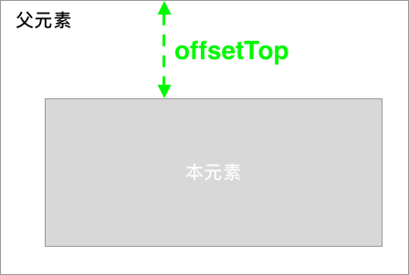

[文章来源](https://www.imooc.com/article/17571)

# 搞清clientHeight、offsetHeight、scrollHeight、offsetTop、scrollTop

每个HTML元素都具有clientHeight offsetHeight scrollHeight offsetTop scrollTop 这5个和元素高度、滚动、位置相关的属性，单凭单词很难搞清楚分别代表什么意思之间有什么区别。通过阅读它们的文档总结出规律如下：

clientHeight和offsetHeight属性和元素的滚动、位置没有关系它代表元素的高度，其中：

clientHeight：包括padding但不包括border、水平滚动条、margin的元素的高度。对于inline的元素这个属性一直是0，单位px，只读元素。

offsetHeight：包括padding、border、水平滚动条，但不包括margin的元素的高度。对于inline的元素这个属性一直是0，单位px，只读元素。

接下来讨论出现有滚动条时的情况：

当本元素的子元素比本元素高且overflow=scroll时，本元素会scroll，这时：

scrollHeight: 因为子元素比父元素高，父元素不想被子元素撑的一样高就显示出了滚动条，在滚动的过程中本元素有部分被隐藏了，scrollHeight代表包括当前不可见部分的元素的高度。而可见部分的高度其实就是clientHeight，也就是scrollHeight>=clientHeight恒成立。在有滚动条时讨论scrollHeight才有意义，在没有滚动条时scrollHeight==clientHeight恒成立。单位px，只读元素。

scrollTop: 代表在有滚动条时，滚动条向下滚动的距离也就是元素顶部被遮住部分的高度。在没有滚动条时scrollTop==0恒成立。单位px，可读可设置。

offsetTop: 当前元素顶部距离最近父元素顶部的距离,和有没有滚动条没有关系。单位px，只读元素。

作者： zsxrping 

链接：https://www.imooc.com/article/17571

来源：慕课网
